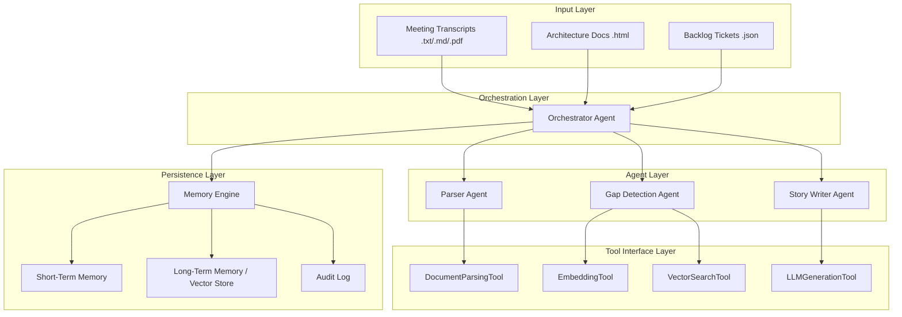
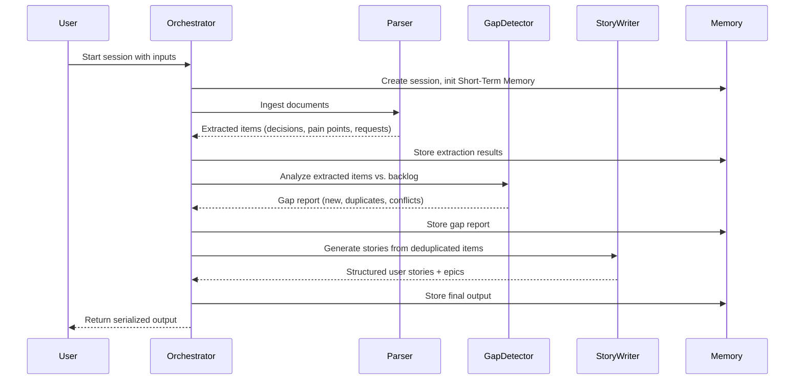

# Design Document: Backlog Synthesizer

## Overview

The Backlog Synthesizer is a multi-agent system built in Python that processes meeting transcripts, architecture documents, and existing backlog tickets to produce structured user stories with acceptance criteria. The system employs an orchestrator pattern where a central agent coordinates specialized sub-agents (Parser, Gap Detection, Story Writer) in a sequential pipeline. A Memory Engine provides state persistence across sessions and enables semantic search for duplicate detection.

The system is designed with modular tool abstractions behind typed interfaces, allowing implementations to be swapped without modifying agent logic. All agent interactions are logged via an Audit Log for traceability and debugging.

### Key Design Decisions

1. **Python as the primary language** — Rich ecosystem for NLP, LLM APIs, and vector stores. The requirements reference Python dicts as fallback memory, confirming Python as the target.
2. **Sequential pipeline (not parallel)** — Requirements mandate strict ordering: Parse → Gap Detection → Story Writing. Each step depends on the prior step's output.
3. **Dependency Injection for tools** — Tool interfaces are defined as Python Protocol classes. Concrete implementations are bound via configuration, satisfying Requirement 9.
4. **Chroma as default vector store** — Lightweight, embeddable, and Python-native. Satisfies Long_Term_Memory needs without infrastructure overhead.
5. **Pydantic for data models** — Provides JSON schema generation, validation, and serialization round-trip guarantees required by Requirements 5 and 10.

## Architecture

The system follows a layered architecture with clear boundaries between orchestration, agent logic, tool interfaces, and persistence.



### Pipeline Flow



## Components and Interfaces

### Orchestrator Agent

**Responsibility:** Receives input, coordinates sub-agents in sequence, manages retries, enforces timeouts, writes results to Memory Engine.

```python
class OrchestratorAgent:
    def __init__(self, config: PipelineConfig, memory: MemoryEngine):
        ...

    async def run_session(self, inputs: SessionInputs) -> SessionResult:
        """Execute the full pipeline for a set of inputs."""
        ...

    async def _invoke_agent(self, agent: SubAgent, payload: Any) -> AgentResult:
        """Invoke a sub-agent with retry logic and timeout enforcement."""
        ...
```

**Retry Policy:**
- Transient errors: up to 3 retries, exponential backoff (1s, 2s, 4s)
- Permanent errors (401, 403, 404, auth failures, schema violations): immediate halt
- Timeout: 120 seconds per sub-agent invocation; timeout treated as transient

### Parser Agent

**Responsibility:** Ingests documents, chunks text, extracts decisions/pain points/feature requests using LLM.

```python
class ParserAgent:
    def __init__(self, parsing_tool: DocumentParsingTool, llm_tool: LLMGenerationTool):
        ...

    async def parse_documents(self, documents: list[InputDocument]) -> ExtractionResult:
        """Parse all input documents and extract structured items."""
        ...

    def _chunk_text(self, text: str, max_tokens: int = 2000, overlap: int = 200) -> list[TextChunk]:
        """Split text into overlapping chunks."""
        ...
```

### Gap Detection Agent

**Responsibility:** Compares extracted items against existing backlog using semantic similarity.

```python
class GapDetectionAgent:
    def __init__(self, embedding_tool: EmbeddingTool, vector_search_tool: VectorSearchTool):
        ...

    async def analyze_gaps(self, items: list[ExtractedItem], timeout: float = 30.0) -> GapReport:
        """Compare items against backlog, flag duplicates and conflicts."""
        ...
```

**Thresholds:**
- Similarity ≥ 0.85 → Duplicate
- Similarity 0.50–0.85 with contradicting statements → Conflict
- Similarity < 0.50 or no contradictions → New

### Story Writer Agent

**Responsibility:** Produces structured user stories, groups them into epics, serializes output.

```python
class StoryWriterAgent:
    def __init__(self, llm_tool: LLMGenerationTool):
        ...

    async def generate_stories(self, items: list[DeduplicatedItem]) -> StoryOutput:
        """Generate user stories with acceptance criteria and group into epics."""
        ...
```

### Memory Engine

**Responsibility:** Manages Short-Term Memory, Long-Term Memory (vector store), and Audit Log.

```python
class MemoryEngine:
    def __init__(self, short_term: ShortTermMemoryTool, long_term: LongTermMemoryTool):
        ...

    async def store_intermediate(self, session_id: str, key: str, data: Any) -> None:
        ...

    async def store_for_search(self, session_id: str, items: list[StorableItem]) -> None:
        ...

    def log_action(self, entry: AuditEntry) -> None:
        ...

    def get_audit_log(self, session_id: str) -> list[AuditEntry]:
        ...
```

### Tool Interfaces (Protocols)

```python
from typing import Protocol

class DocumentParsingTool(Protocol):
    def pdf_to_text(self, content: bytes) -> str: ...
    def chunk_text(self, text: str, max_tokens: int, overlap: int) -> list[str]: ...

class EmbeddingTool(Protocol):
    def generate_embedding(self, text: str) -> list[float]: ...

class VectorSearchTool(Protocol):
    def query_similar(self, embedding: list[float], top_k: int) -> list[SearchResult]: ...
    def store(self, item_id: str, embedding: list[float], metadata: dict) -> None: ...

class LLMGenerationTool(Protocol):
    def generate(self, prompt: str, system_prompt: str | None = None) -> str: ...
```

### Evaluation Framework

```python
class EvaluationFramework:
    def __init__(self, golden_dataset: list[GoldenEntry], pipeline: OrchestratorAgent, llm_judge: LLMGenerationTool):
        ...

    async def run_evaluation(self) -> EvaluationReport:
        """Run pipeline against all golden dataset entries and compute scores."""
        ...

    def _compute_keyword_overlap(self, generated: list[str], expected: list[str]) -> float:
        """Normalized keyword overlap score (0.0 to 1.0)."""
        ...

    async def _llm_judge_score(self, story: UserStory, expected: UserStory) -> JudgeScores:
        """Score a story on relevance, completeness, clarity (1-5 each)."""
        ...
```

## Data Models

All data models use Pydantic `BaseModel` for automatic JSON schema generation, validation, and serialization.

### Input Models

```python
from pydantic import BaseModel, Field
from enum import Enum
from datetime import datetime

class DocumentType(str, Enum):
    TRANSCRIPT_TXT = "transcript_txt"
    TRANSCRIPT_MD = "transcript_md"
    TRANSCRIPT_PDF = "transcript_pdf"
    ARCHITECTURE_HTML = "architecture_html"
    BACKLOG_JSON = "backlog_json"

class InputDocument(BaseModel):
    filename: str
    document_type: DocumentType
    content: bytes  # raw file bytes
    size_bytes: int

class BacklogTicket(BaseModel):
    id: str
    title: str
    description: str
    status: str
    tags: list[str] = Field(default_factory=list)
    created_at: datetime | None = None

class SessionInputs(BaseModel):
    session_id: str
    documents: list[InputDocument]
    backlog_tickets: list[BacklogTicket] = Field(default_factory=list)
```

### Extraction Models

```python
class TextChunk(BaseModel):
    index: int
    text: str
    token_count: int

class ExtractedItem(BaseModel):
    item_type: str  # "decision", "pain_point", "feature_request", "constraint"
    text: str
    source_chunk_index: int
    char_offset: int | None = None
    confidence: float = Field(ge=0.0, le=1.0)
    stakeholder: str | None = None
    section_heading: str | None = None
    type_classification: str | None = None  # for architecture items

class ExtractionResult(BaseModel):
    items: list[ExtractedItem]
    errors: list[DocumentError] = Field(default_factory=list)
    metadata: dict = Field(default_factory=dict)

class DocumentError(BaseModel):
    filename: str
    reason: str
    byte_offset: int | None = None
    line_number: int | None = None
```

### Gap Detection Models

```python
class DuplicateFlag(BaseModel):
    extracted_item: ExtractedItem
    matching_ticket_id: str
    similarity_score: float = Field(ge=0.0, le=1.0)

class ConflictFlag(BaseModel):
    item_a: ExtractedItem
    item_b_ticket_id: str
    similarity_score: float = Field(ge=0.50, le=0.85)
    contradiction_description: str

class GapReportEntry(BaseModel):
    item: ExtractedItem
    classification: str  # "new", "duplicate", "conflict", "unprocessed"
    confidence: float = Field(ge=0.0, le=1.0)
    duplicate_info: DuplicateFlag | None = None
    conflict_info: ConflictFlag | None = None
    error_reason: str | None = None  # for unprocessed items

class GapReport(BaseModel):
    entries: list[GapReportEntry]
    total_new: int
    total_duplicates: int
    total_conflicts: int
    total_unprocessed: int
```

### Output Models

```python
class AcceptanceCriterion(BaseModel):
    description: str

class UserStory(BaseModel):
    title: str
    user_story: str  # "As a [role], I want [goal], so that [benefit]"
    acceptance_criteria: list[AcceptanceCriterion] = Field(min_length=2, max_length=10)
    tags: list[str] = Field(min_length=1, max_length=5)
    needs_refinement: bool = False

class Epic(BaseModel):
    epic_title: str = Field(max_length=60)
    stories: list[UserStory]

class OutputMetadata(BaseModel):
    session_id: str
    timestamp: datetime  # ISO 8601

class StoryOutput(BaseModel):
    index: list[dict]  # [{epic_title: str, story_count: int}]
    epics: list[Epic]
    metadata: OutputMetadata
```

### Memory and Audit Models

```python
class AuditEntry(BaseModel):
    timestamp: datetime
    agent_name: str
    input_summary: str = Field(max_length=500)
    output_summary: str = Field(max_length=500)
    duration_ms: int

class SessionState(BaseModel):
    session_id: str
    created_at: datetime
    status: str  # "in_progress", "completed", "partial_failure", "permanent_failure"
    extraction_result: ExtractionResult | None = None
    gap_report: GapReport | None = None
    story_output: StoryOutput | None = None
    errors: list[dict] = Field(default_factory=list)
```

### Evaluation Models

```python
class GoldenEntry(BaseModel):
    transcript: str
    expected_stories: list[UserStory]

class JudgeScores(BaseModel):
    relevance: int = Field(ge=1, le=5)
    completeness: int = Field(ge=1, le=5)
    clarity: int = Field(ge=1, le=5)

class EvaluationCaseResult(BaseModel):
    case_index: int
    keyword_overlap_score: float = Field(ge=0.0, le=1.0)
    judge_scores: JudgeScores | None = None
    failure_reason: str | None = None

class EvaluationReport(BaseModel):
    results: list[EvaluationCaseResult]
    aggregate_keyword_overlap_mean: float
    aggregate_keyword_overlap_min: float
    aggregate_relevance_mean: float | None = None
    aggregate_completeness_mean: float | None = None
    aggregate_clarity_mean: float | None = None
```

## Correctness Properties

*A property is a characteristic or behavior that should hold true across all valid executions of a system — essentially, a formal statement about what the system should do. Properties serve as the bridge between human-readable specifications and machine-verifiable correctness guarantees.*

### Property 1: Output JSON round-trip serialization

*For any* valid `StoryOutput` instance, serializing to JSON and then deserializing back to a `StoryOutput` instance SHALL produce a semantically equivalent object — i.e., `StoryOutput.model_validate_json(output.model_dump_json()) == output`.

**Validates: Requirements 10.2**

### Property 2: Document chunking preserves content with bounded size

*For any* input text string, chunking with `max_tokens=2000` and `overlap=200` SHALL produce chunks where: (a) each chunk contains at most 2000 tokens, (b) consecutive chunks share exactly 200 tokens of overlap, and (c) reconstructing from the chunks (removing overlapping regions) reproduces the original text exactly.

**Validates: Requirements 3.5**

### Property 3: Backlog ticket validation accepts valid and rejects invalid entries

*For any* list of JSON objects, where some conform to the BacklogTicket schema and some do not, validating the list SHALL accept all conforming entries and reject all non-conforming entries, with the count of accepted + rejected entries equaling the total input count.

**Validates: Requirements 1.4, 1.6**

### Property 4: Extracted item structural validity

*For any* extracted item (decision, pain point, feature request, or constraint), the item SHALL contain a non-empty text field, a non-negative source_chunk_index, and a confidence score in the range [0.0, 1.0]. Architecture items SHALL additionally have a non-empty section_heading and a type_classification of "constraint", "decision", or "principle".

**Validates: Requirements 3.1, 3.2, 3.3, 3.4**

### Property 5: Gap classification correctness by similarity threshold

*For any* extracted item compared against existing backlog tickets: (a) if the highest semantic similarity score is ≥ 0.85, it SHALL be classified as "duplicate" with the matching ticket ID, (b) if the score is in [0.50, 0.85) and contradicting statements are present, it SHALL be classified as "conflict" with a contradiction description, (c) otherwise it SHALL be classified as "new". All classifications SHALL have a confidence score in [0.0, 1.0].

**Validates: Requirements 4.2, 4.3, 4.4**

### Property 6: Empty backlog marks all items as new

*For any* list of extracted items and an empty set of existing backlog tickets, the Gap_Detection_Agent SHALL classify every item as "new" with a confidence score of exactly 1.0.

**Validates: Requirements 4.5**

### Property 7: User story structural validity

*For any* generated UserStory, the `user_story` field SHALL match the pattern "As a [role], I want [goal], so that [benefit]", the `acceptance_criteria` list SHALL contain between 2 and 10 entries inclusive, and the `tags` list SHALL contain between 1 and 5 entries inclusive.

**Validates: Requirements 5.1, 5.2, 5.3**

### Property 8: Epic grouping by shared tags

*For any* set of generated UserStories where two or more stories share at least one tag, those stories SHALL appear under a common Epic whose `epic_title` is at most 60 characters long.

**Validates: Requirements 5.4**

### Property 9: Retry policy for transient errors

*For any* sub-agent invocation that fails with a transient error, the Orchestrator SHALL retry up to 3 times with backoff delays of 1s, 2s, 4s. If the invocation succeeds on any retry, processing continues normally. If all 3 retries are exhausted, the failure is reported.

**Validates: Requirements 2.5, 7.1**

### Property 10: No retry for permanent errors

*For any* sub-agent invocation that fails with a permanent error (HTTP 401, 403, 404, authentication failure, or schema violation), the Orchestrator SHALL NOT retry and SHALL immediately halt the pipeline with a "permanent_failure" status.

**Validates: Requirements 2.6, 7.3**

### Property 11: Partial failure result structure

*For any* pipeline execution where at least one step succeeds and at least one step fails after retries, the result SHALL have status "partial_failure" and include an `errors` array where each entry describes the failed step, such that the count of successfully completed steps plus failed steps equals the total pipeline steps attempted.

**Validates: Requirements 7.2**

### Property 12: Keyword overlap score computation

*For any* two lists of keyword tokens (generated and expected), the keyword overlap score SHALL equal the count of case-insensitive matching tokens divided by the total token count in the expected list, producing a value in [0.0, 1.0]. If expected is empty, the score SHALL be 1.0.

**Validates: Requirements 8.3**

### Property 13: Audit log chronological ordering

*For any* set of audit entries recorded for a session (regardless of insertion order), retrieving the audit log for that session SHALL return entries sorted by timestamp in ascending order.

**Validates: Requirements 6.7**

### Property 14: Short-term memory round-trip by session ID

*For any* session_id and data payload stored in Short_Term_Memory, retrieving by that session_id SHALL return a value equal to the originally stored payload.

**Validates: Requirements 6.1**

### Property 15: Tool error translation

*For any* implementation-specific exception raised within a concrete Tool implementation, the Tool layer SHALL translate it into the interface-defined error type before it propagates to the calling agent, such that agents never observe implementation-specific exception types.

**Validates: Requirements 9.6**

### Property 16: Output index array consistency

*For any* StoryOutput containing epics, the top-level `index` array SHALL have exactly one entry per Epic, where each entry's `epic_title` matches the corresponding Epic's title and `story_count` equals the length of that Epic's stories list.

**Validates: Requirements 10.3**

### Property 17: Malformed document error structure

*For any* malformed or unreadable input document, the Parser_Agent SHALL return an error object containing a non-empty `filename` field matching the input document's name, a non-empty `reason` field, and optionally a `byte_offset` or `line_number` if determinable from the failure.

**Validates: Requirements 1.5**

### Property 18: HTML stripping preserves heading hierarchy

*For any* HTML document with heading elements (h1-h6), the Parser_Agent SHALL produce output text that contains no HTML tags and preserves the nesting order of headings — i.e., if heading A appears before heading B in the source, it appears before B in the output, and the heading level hierarchy is represented in the structured section output.

**Validates: Requirements 1.3**

## Error Handling

### Error Classification

| Error Type | HTTP Codes / Signals | Action |
|---|---|---|
| Transient | 429, 500, 502, 503, 504, network timeout, sub-agent timeout | Retry up to 3 times (1s, 2s, 4s backoff) |
| Permanent | 401, 403, 404, auth failure, schema violation | Immediate halt, no retry |
| Infrastructure | Vector store timeout (>10s), Short-Term Memory unavailable | Graceful degradation with warnings |

### Retry Strategy

```python
async def _invoke_with_retry(self, agent, payload, max_retries=3):
    backoff = 1.0
    for attempt in range(max_retries + 1):
        try:
            result = await asyncio.wait_for(
                agent.invoke(payload),
                timeout=120.0
            )
            return result
        except PermanentError as e:
            self._audit_log(agent, payload, error=e)
            raise PipelineHaltError(e)
        except (TransientError, asyncio.TimeoutError) as e:
            if attempt == max_retries:
                self._audit_log(agent, payload, error=e, attempts=max_retries+1)
                raise RetryExhaustedError(e)
            await asyncio.sleep(backoff)
            backoff *= 2
```

### Graceful Degradation

- **Vector store unreachable (>10s)**: Gap Detection skips duplicate analysis, annotates output with warning
- **Short-Term Memory unavailable**: Falls back to in-process Python dict, logs warning to Audit_Log
- **Partial pipeline failure**: Returns successfully completed results with `status: "partial_failure"` and `errors` array describing failures

### Error Propagation

Tool implementations translate implementation-specific exceptions into interface-defined error types:

```python
class ToolError(Exception):
    """Base error type for all tool interfaces."""
    def __init__(self, message: str, original_error: Exception | None = None):
        super().__init__(message)
        self.original_error = original_error

class TransientToolError(ToolError): ...
class PermanentToolError(ToolError): ...
```

## Testing Strategy

### Dual Testing Approach

This project uses both unit/example-based tests and property-based tests for comprehensive coverage.

### Property-Based Testing

**Library:** [Hypothesis](https://hypothesis.readthedocs.io/) (Python's standard PBT library)

**Configuration:**
- Minimum 100 examples per property test (`@settings(max_examples=100)`)
- Each property test references its design document property number
- Tag format: `# Feature: backlog-synthesizer, Property {N}: {title}`

**Properties to implement as PBT:**
1. Output JSON round-trip serialization (Property 1)
2. Document chunking bounds and overlap (Property 2)
3. Backlog ticket validation (Property 3)
4. Extracted item structural validity (Property 4)
5. Gap classification by threshold (Property 5)
6. Empty backlog → all new (Property 6)
7. User story structural validity (Property 7)
8. Epic grouping by shared tags (Property 8)
9. Retry policy for transient errors (Property 9)
10. No retry for permanent errors (Property 10)
11. Partial failure result structure (Property 11)
12. Keyword overlap computation (Property 12)
13. Audit log chronological ordering (Property 13)
14. Short-term memory round-trip (Property 14)
15. Tool error translation (Property 15)
16. Output index array consistency (Property 16)
17. Malformed document error structure (Property 17)
18. HTML stripping preserves heading hierarchy (Property 18)

### Unit / Example-Based Tests

For criteria classified as EXAMPLE, EDGE_CASE, INTEGRATION, or SMOKE:

- **Pipeline ordering** (2.1–2.4): Unit tests with mocked agents verifying invocation order
- **Memory write between agents** (2.4): Mock-based test verifying Memory Engine calls
- **Insufficient detail placeholder** (5.6): Example test with minimal input
- **Vector store timeout** (7.4): Mocked timeout test
- **Sub-agent timeout enforcement** (7.5, 7.6): Mocked timeout tests
- **Empty extraction result** (3.6): Edge case with document yielding no items
- **Invalid/expired session audit query** (6.8): Edge case returning empty
- **Evaluation pipeline failure** (8.6): Mock failure, verify score 0

### Integration Tests

- PDF-to-text conversion through real DocumentParsingTool (1.2)
- Vector store semantic search end-to-end (4.1, 6.2, 6.3)
- Full evaluation run against golden dataset (8.2)
- Tool implementation swap verification (9.4)

### Smoke Tests

- Golden dataset has ≥3 entries with required content (8.1)
- Data retention policy configured ≥30 days (6.5)
- Tool interfaces have typed signatures (mypy check) (9.5)
- Configuration mechanism binds tools correctly (9.7)

