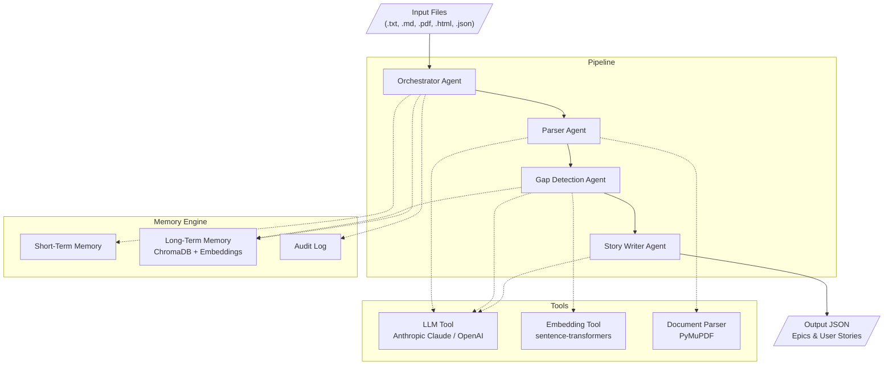

# Backlog Synthesizer

[](https://github.com/AnshulRehpade/backlog-synthesizer/actions/workflows/test.yml)
[](https://github.com/AnshulRehpade/backlog-synthesizer/actions/workflows/test.yml)
[](https://www.python.org/downloads/)

A multi-agent system that transforms unstructured meeting transcripts and architecture documents into structured, deduplicated user stories ready for your product backlog. It solves the problem of information loss between meetings and ticketing systems — decisions get made, pain points get raised, and feature requests surface in conversations, but without disciplined manual note-taking, much of that signal never makes it into actionable backlog items.

The system ingests documents in multiple formats (text transcripts, PDFs, HTML architecture docs, existing JSON backlog tickets), extracts decisions, pain points, and feature requests using LLM-powered analysis, detects duplicates and conflicts against your existing backlog via semantic similarity, and produces well-formed user stories grouped into epics. The output is a structured JSON document with stories in "As a [role], I want [goal], so that [benefit]" format, complete with acceptance criteria and feature tags.

## Architecture

Backlog Synthesizer uses a multi-agent pipeline architecture with four specialized agents coordinated by a central orchestrator and backed by a unified Memory Engine.

### Agents

| Agent | Responsibility |
|-------|---------------|
| **Orchestrator Agent** | Coordinates the pipeline sequence, manages session state, validates inputs, handles retries with exponential backoff, and routes data between sub-agents. Halts on permanent errors, retries on transient failures (up to 3 attempts). |
| **Parser Agent** | Ingests documents (text, PDF via PyMuPDF, HTML with heading-hierarchy preservation), chunks text with overlapping windows (2000 tokens, 200-token overlap), and uses the LLM to extract decisions, pain points, feature requests, and constraints from each chunk. |
| **Gap Detection Agent** | Generates embeddings for extracted items, queries the vector store for semantic similarity against existing backlog items, and classifies each item as `new` (similarity < 0.50), `duplicate` (≥ 0.85), or `conflict` (0.50–0.85 with LLM-confirmed contradiction). |
| **Story Writer Agent** | Takes deduplicated items (classified as `new` or `conflict`), generates structured user stories via LLM, groups stories into epics using a union-find algorithm on shared tags, and serializes the final output. Items with insufficient detail produce placeholder stories tagged `needs-refinement`. |

### Memory Engine

The Memory Engine is a facade coordinating three subsystems:

- **Short-Term Memory** — In-session state storage (keyed by session ID). Supports a pluggable primary store (e.g., Redis) with automatic fallback to an in-process Python dictionary. Logs a warning to the audit system when fallback activates.
- **Long-Term Memory** — Vector-backed semantic search using embeddings stored in ChromaDB. Supports a 30-day retention policy for stored entries. Used by Gap Detection to compare new items against existing backlog.
- **Audit Log** — Chronological record of every sub-agent invocation with input/output summaries and duration metrics. Enables traceability and debugging of pipeline runs.

### Architecture Diagram



**Data flow:** Input files → Orchestrator validates & routes → Parser extracts items → Gap Detection classifies against existing backlog → Story Writer generates stories & groups into epics → JSON output.

## Prerequisites

- **Python 3.11+**
- An **Anthropic API key** (default provider) or an **OpenAI API key** (alternative)
- ~500 MB disk space for the `all-MiniLM-L6-v2` sentence-transformer model (downloaded on first run)

## Installation

```bash
# Clone the repository
git clone <repository-url>
cd "Backlog Synthesizer"

# Create and activate a virtual environment
python -m venv .venv
source .venv/bin/activate  # On Windows: .venv\Scripts\activate

# Install the package in editable mode with dev dependencies
pip install -e ".[dev]"
```

### Configuration

Create a `.env` file in the project root (or copy the existing one):

```env
# LLM Provider: "anthropic" or "openai"
LLM_PROVIDER=anthropic

# Anthropic (Claude) settings
ANTHROPIC_API_KEY=your-anthropic-api-key-here
ANTHROPIC_MODEL=claude-haiku-4-20250414
ANTHROPIC_MAX_TOKENS=4096
ANTHROPIC_TIMEOUT=60

# OpenAI settings (used when LLM_PROVIDER=openai)
# OPENAI_API_KEY=your-openai-api-key-here
# OPENAI_MODEL=gpt-4o-mini
# OPENAI_TIMEOUT=60

# Embedding settings (runs locally, no API key needed)
EMBEDDING_MODEL=all-MiniLM-L6-v2

# ChromaDB settings
CHROMA_COLLECTION=backlog_items
# CHROMA_PERSIST_DIR=./data/chroma  # Uncomment for persistent storage
```

The embedding model runs entirely locally using `sentence-transformers` — no API key required. ChromaDB operates in ephemeral (in-memory) mode by default; set `CHROMA_PERSIST_DIR` to persist vectors across runs.

## Quick Start

Run the pipeline against one of the included sample transcripts:

```bash
python -m backlog_synthesizer.main data/golden_dataset/transcript_01_authentication.txt
```

Process multiple files at once (transcripts + existing backlog):

```bash
python -m backlog_synthesizer.main \
  data/golden_dataset/transcript_01_authentication.txt \
  data/golden_dataset/transcript_02_performance.txt
```

Supported file types:

| Extension | Treated as |
|-----------|-----------|
| `.txt`, `.md` | Meeting transcripts |
| `.pdf` | PDF transcripts |
| `.html` | Architecture documents (wiki export) |
| `.json` | Existing backlog tickets (for deduplication) |

## Example Output

The pipeline produces a JSON document conforming to the `StoryOutput` schema:

```json
{
  "index": [
    {"epic_title": "User Auth & Security", "story_count": 3},
    {"epic_title": "Session Management", "story_count": 1}
  ],
  "epics": [
    {
      "epic_title": "User Auth & Security",
      "stories": [
        {
          "title": "Implement Multi-Factor Authentication",
          "user_story": "As an enterprise customer, I want multi-factor authentication with TOTP and SMS fallback, so that I can meet my organization's security compliance requirements",
          "acceptance_criteria": [
            {"description": "Users can enable TOTP-based MFA via authenticator app"},
            {"description": "SMS fallback is available when TOTP is not configured"},
            {"description": "MFA can be enforced at the organization level by admins"},
            {"description": "Recovery codes are generated during MFA setup"}
          ],
          "tags": ["user-auth", "mfa", "security"],
          "needs_refinement": false
        },
        {
          "title": "Magic Link Login Option",
          "user_story": "As a user, I want to log in via a magic link sent to my email, so that I have an alternative to password-based authentication",
          "acceptance_criteria": [
            {"description": "Users can request a magic link from the login page"},
            {"description": "Magic links expire after 10 minutes"},
            {"description": "Only one active magic link per user at a time"}
          ],
          "tags": ["user-auth", "magic-link"],
          "needs_refinement": false
        },
        {
          "title": "Token Revocation Mechanism",
          "user_story": "As a security engineer, I want to revoke compromised JWT tokens before their natural expiry, so that stolen tokens cannot be used for unauthorized access",
          "acceptance_criteria": [
            {"description": "Admins can revoke all tokens for a specific user"},
            {"description": "Revoked tokens are rejected on subsequent API calls"},
            {"description": "Token revocation propagates within 60 seconds"}
          ],
          "tags": ["security", "jwt", "token-management"],
          "needs_refinement": false
        }
      ]
    },
    {
      "epic_title": "Session Management",
      "stories": [
        {
          "title": "Configurable Session Timeout",
          "user_story": "As an organization admin, I want to configure session timeout values for my organization, so that I can enforce compliance-appropriate idle timeout policies",
          "acceptance_criteria": [
            {"description": "Session timeout is configurable per organization"},
            {"description": "Minimum timeout is 5 minutes, maximum is 24 hours"},
            {"description": "Default timeout remains 30 minutes for new organizations"}
          ],
          "tags": ["session-management", "enterprise"],
          "needs_refinement": false
        }
      ]
    }
  ],
  "metadata": {
    "session_id": "a1b2c3d4-e5f6-7890-abcd-ef1234567890",
    "timestamp": "2024-01-15T14:30:00Z"
  }
}
```

## Design Decisions and Tradeoffs

**Protocol-based dependency injection.** All tools (LLM, embeddings, vector search, document parsing) are defined as Python `Protocol` interfaces. Agents depend on protocols, not implementations. Swapping providers (e.g., Anthropic → OpenAI) requires only a config change — zero modifications to agent code.

**Overlapping text chunks (2000 tokens, 200-token overlap).** Ensures no information is lost at chunk boundaries. The tradeoff is slightly higher LLM token consumption for documents that span many chunks, but it eliminates the risk of splitting a decision or feature request across two chunks where neither chunk has enough context.

**Union-find for epic grouping.** Stories are grouped into epics transitively via shared tags. If story A shares a tag with B, and B shares a tag with C, all three land in the same epic. This is simple and deterministic but can produce overly broad epics when generic tags (e.g., `needs-refinement`) connect otherwise unrelated stories.

**ChromaDB ephemeral by default.** Optimizes for the common single-session use case (process transcripts → get output). For teams that want cross-session duplicate detection, setting `CHROMA_PERSIST_DIR` enables persistent storage with a 30-day retention policy.

**Placeholder stories for low-confidence items.** Rather than silently dropping vague transcript items (confidence < 0.3 or text < 10 chars), the system produces placeholder stories tagged `needs-refinement`. This preserves signal for human review without polluting the backlog with unactionable tickets.

**Retry with exponential backoff.** Transient LLM/tool failures get 3 retries (1s, 2s, 4s backoff). Permanent errors (invalid API key, schema violations) halt the pipeline immediately. This balances reliability against latency for the common case of intermittent API rate limits.

**LLM-as-judge for contradiction detection.** In the conflict range (similarity 0.50–0.85), the system uses an LLM call to confirm whether two items genuinely contradict each other, rather than relying solely on the embedding distance. This adds latency but significantly reduces false-positive conflict classifications.

## Evaluation Framework

The evaluation framework scores pipeline output against a golden dataset of transcript/expected-story pairs using two complementary methods:

1. **Keyword overlap** — Normalized token matching between generated and expected acceptance criteria. Provides a fast, deterministic baseline metric.
2. **LLM-as-judge** — An independent LLM scores each generated story on three dimensions (1–5 scale): relevance, completeness, and clarity.

### Golden Dataset

The golden dataset lives in `data/golden_dataset/` with three sample transcripts and their expected outputs:

```
data/golden_dataset/
├── transcript_01_authentication.txt
├── expected_01_authentication.json
├── transcript_02_performance.txt
├── expected_02_performance.json
├── transcript_03_ux_improvements.txt
└── expected_03_ux_improvements.json
```

### Running Evaluations

The evaluation framework is implemented in `src/backlog_synthesizer/evaluation/framework.py`. To run it programmatically:

```python
import asyncio
import json
from pathlib import Path

from backlog_synthesizer.evaluation.framework import EvaluationFramework
from backlog_synthesizer.models.evaluation import GoldenEntry
from backlog_synthesizer.main import create_pipeline
from backlog_synthesizer.config import PipelineConfig

# Load golden dataset
golden_entries = []
for i in range(1, 4):
    transcript = Path(f"data/golden_dataset/transcript_0{i}_authentication.txt").read_text()
    expected = json.loads(Path(f"data/golden_dataset/expected_0{i}_authentication.json").read_text())
    golden_entries.append(GoldenEntry(transcript=transcript, expected_stories=expected))

# Create pipeline and evaluation framework
config = PipelineConfig.from_env()
pipeline = create_pipeline(config)
llm_judge = config.create_llm_tool()

framework = EvaluationFramework(
    golden_dataset=golden_entries,
    pipeline=pipeline,
    llm_judge=llm_judge,
)

# Run evaluation
report = asyncio.run(framework.run_evaluation())
print(f"Keyword overlap (mean): {report.aggregate_keyword_overlap_mean:.2f}")
print(f"Keyword overlap (min):  {report.aggregate_keyword_overlap_min:.2f}")
if report.aggregate_relevance_mean is not None:
    print(f"Judge relevance (mean): {report.aggregate_relevance_mean:.1f}/5")
    print(f"Judge completeness (mean): {report.aggregate_completeness_mean:.1f}/5")
    print(f"Judge clarity (mean): {report.aggregate_clarity_mean:.1f}/5")
```

If the pipeline fails for any golden entry, the framework records the failure reason, assigns a score of 0 for that case, and continues with remaining entries.

## Testing Strategy

The test suite contains 326 property-based and unit tests built with **pytest**, **Hypothesis**, and **pytest-asyncio**. Tests are organized by component with dedicated property-based test files verifying structural invariants.

### Test Organization

```
tests/
├── test_data_model_properties.py       # Property tests: Pydantic model invariants
├── test_parser_chunking_properties.py  # Property tests: chunking correctness
├── test_parser_document_properties.py  # Property tests: document ingestion
├── test_gap_detection_properties.py    # Property tests: classification thresholds
├── test_memory_properties.py           # Property tests: memory store/retrieve
├── test_orchestrator_retry_properties.py # Property tests: retry/backoff behavior
├── test_story_writer_properties.py     # Property tests: story generation invariants
├── test_parser_chunking.py             # Unit tests: text chunking
├── test_parser_ingestion.py            # Unit tests: document ingestion (text, PDF, HTML)
├── test_parser_extraction.py           # Unit tests: LLM extraction with mocks
├── test_gap_detection_agent.py         # Unit tests: gap detection pipeline
├── test_story_writer_agent.py          # Unit tests: story generation & serialization
├── test_epic_grouping.py              # Unit tests: union-find epic grouping
├── test_orchestrator.py               # Unit tests: full pipeline orchestration
├── test_orchestrator_retry.py         # Unit tests: retry and error handling
├── test_backlog_ticket_validation.py  # Unit tests: input validation
├── test_output_serialization.py       # Unit tests: JSON serialization
├── test_short_term_memory.py          # Unit tests: short-term memory & fallback
├── test_long_term_memory.py           # Unit tests: vector search integration
├── test_memory_engine.py              # Unit tests: memory engine facade
├── test_audit_log.py                  # Unit tests: audit log recording
├── test_evaluation_framework.py       # Unit tests: evaluation scoring
└── test_main.py                       # Unit tests: CLI entry point
```

### Property-Based Tests

Hypothesis-powered property tests verify invariants that must hold for any valid input:

- **Output round-trip serialization** — Any `StoryOutput` survives JSON serialize/deserialize without data loss
- **Chunking coverage** — Reconstructing text from overlapping chunks reproduces the original
- **Classification thresholds** — Similarity ≥ 0.85 always yields `duplicate`, < 0.50 always yields `new`
- **Memory idempotency** — Storing a value and retrieving it returns the same value
- **Acceptance criteria bounds** — Every generated story has 2–10 acceptance criteria
- **Tag bounds** — Every generated story has 1–5 tags
- **Epic title length** — All epic titles are ≤ 60 characters

### Running Tests

```bash
# Run the full test suite
pytest

# Run with verbose output
pytest -v

# Run only property-based tests
pytest -k "properties"

# Run tests for a specific component
pytest tests/test_gap_detection_properties.py

# Run with coverage
pytest --cov=backlog_synthesizer
```

Hypothesis is configured with `max_examples = 100` per property (set in `pyproject.toml`). Tests run without any API keys or external services — all LLM and embedding calls are mocked in the test fixtures.

## License

MIT

## Configuration Reference

All configuration is loaded from environment variables (via `.env` file) with sensible defaults. Copy `.env.example` to `.env` to get started.

### Required Variables

| Variable | Description | Where to get it |
|----------|-------------|-----------------|
| `ANTHROPIC_API_KEY` | Anthropic API key (required when `LLM_PROVIDER=anthropic`) | [console.anthropic.com/settings/keys](https://console.anthropic.com/settings/keys) |
| `OPENAI_API_KEY` | OpenAI API key (required when `LLM_PROVIDER=openai`) | [platform.openai.com/api-keys](https://platform.openai.com/api-keys) |

Only one API key is needed — whichever provider you select.

### Optional Variables

| Variable | Default | Description |
|----------|---------|-------------|
| `LLM_PROVIDER` | `anthropic` | Which LLM backend to use: `anthropic` or `openai` |
| `ANTHROPIC_MODEL` | `claude-haiku-4-20250414` | Claude model identifier |
| `ANTHROPIC_MAX_TOKENS` | `4096` | Maximum tokens in Claude responses |
| `ANTHROPIC_TIMEOUT` | `60` | Request timeout (seconds) for Anthropic API |
| `OPENAI_MODEL` | `gpt-4o-mini` | OpenAI model identifier |
| `OPENAI_BASE_URL` | _(none)_ | Custom base URL for OpenAI-compatible APIs (Azure, local servers) |
| `OPENAI_TIMEOUT` | `60` | Request timeout (seconds) for OpenAI API |
| `EMBEDDING_MODEL` | `all-MiniLM-L6-v2` | Sentence-transformer model for local embeddings |
| `CHROMA_COLLECTION` | `backlog_items` | ChromaDB collection name |
| `CHROMA_PERSIST_DIR` | _(none/ephemeral)_ | Directory for persistent vector storage. Unset = in-memory only. |
| `BACKLOG_SYNTHESIZER_CONFIG` | _(none)_ | Path to a JSON config file with additional overrides |

### Pipeline Constants (not configurable via env)

These are design-level parameters defined by the system requirements:

| Constant | Value | Location | Purpose |
|----------|-------|----------|---------|
| Chunk size | 2000 tokens | `parser.py` | Maximum tokens per text chunk sent to LLM |
| Chunk overlap | 200 tokens | `parser.py` | Overlap between consecutive chunks to preserve context |
| Sub-agent timeout | 120 seconds | `orchestrator.py` | Maximum time per sub-agent invocation |
| Gap detection timeout | 30 seconds | `gap_detection.py` | Timeout for similarity search per item |
| Max retries | 3 | `orchestrator.py` | Retry count for transient failures |
| Retry backoff | 1s, 2s, 4s | `orchestrator.py` | Exponential backoff between retries |
| Duplicate threshold | ≥ 0.85 | `gap_detection.py` | Cosine similarity above which items are duplicates |
| Conflict threshold | 0.50–0.85 | `gap_detection.py` | Range where LLM checks for contradictions |

### JSON Config File

For advanced deployments, you can provide a JSON file (via `BACKLOG_SYNTHESIZER_CONFIG` env var) with any of the above optional variables in snake_case:

```json
{
  "llm_provider": "openai",
  "openai_model": "gpt-4o",
  "chroma_persist_dir": "/var/data/backlog-vectors"
}
```

Config file values override environment variables, which override defaults.

